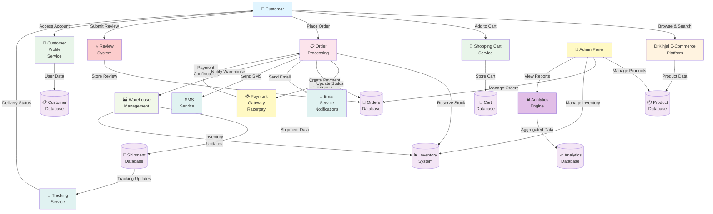
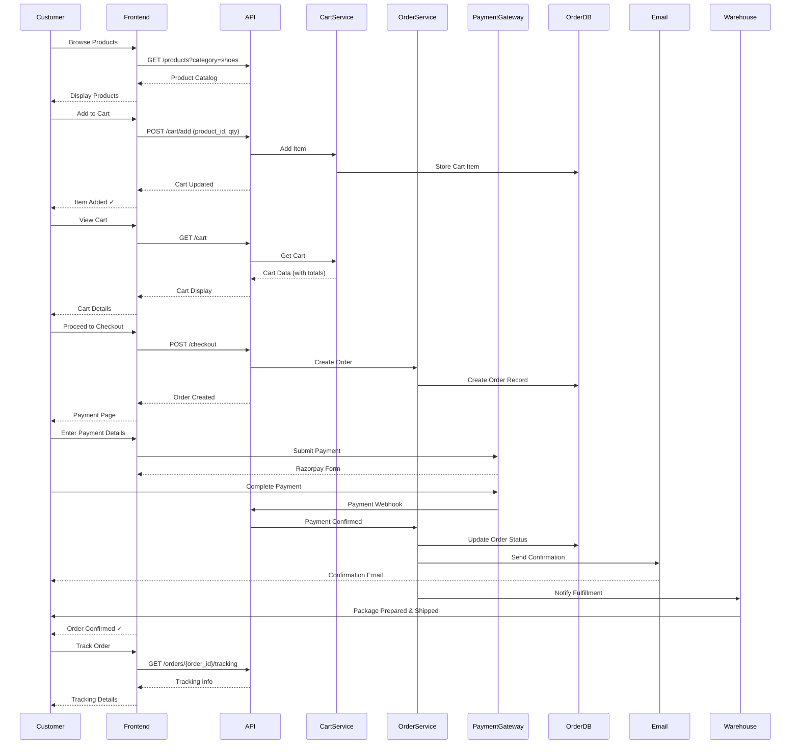
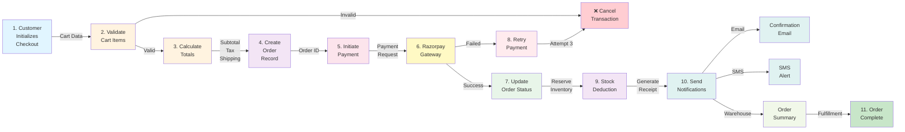
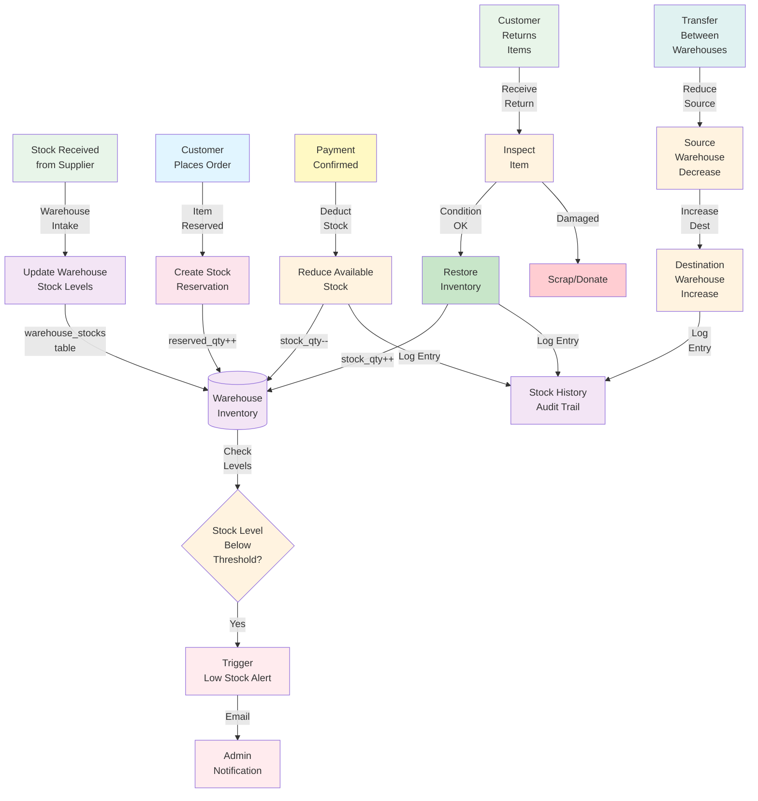
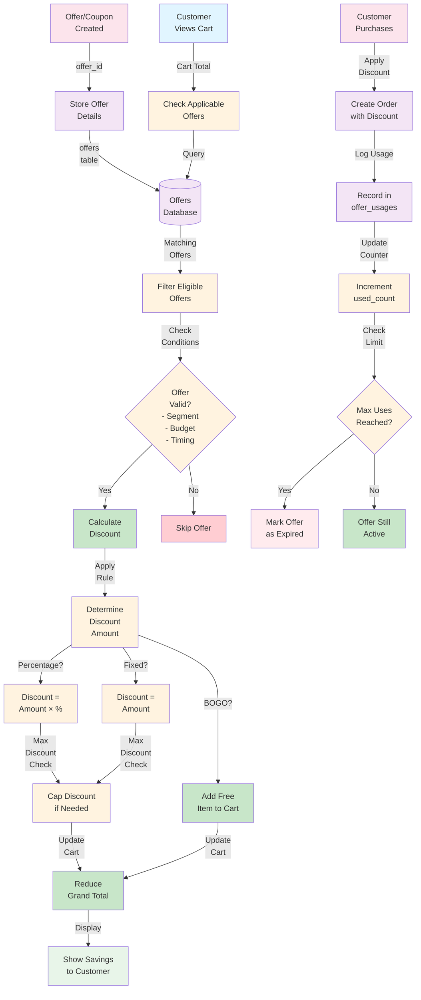
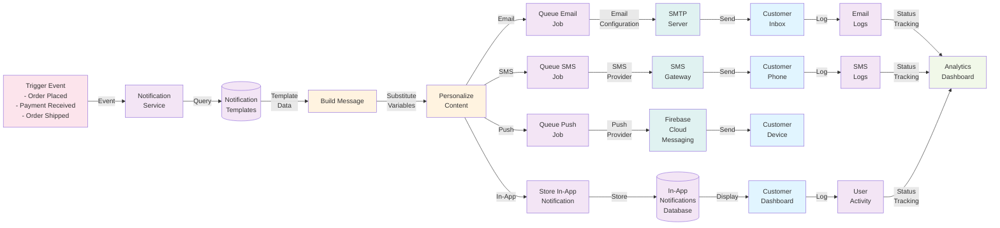
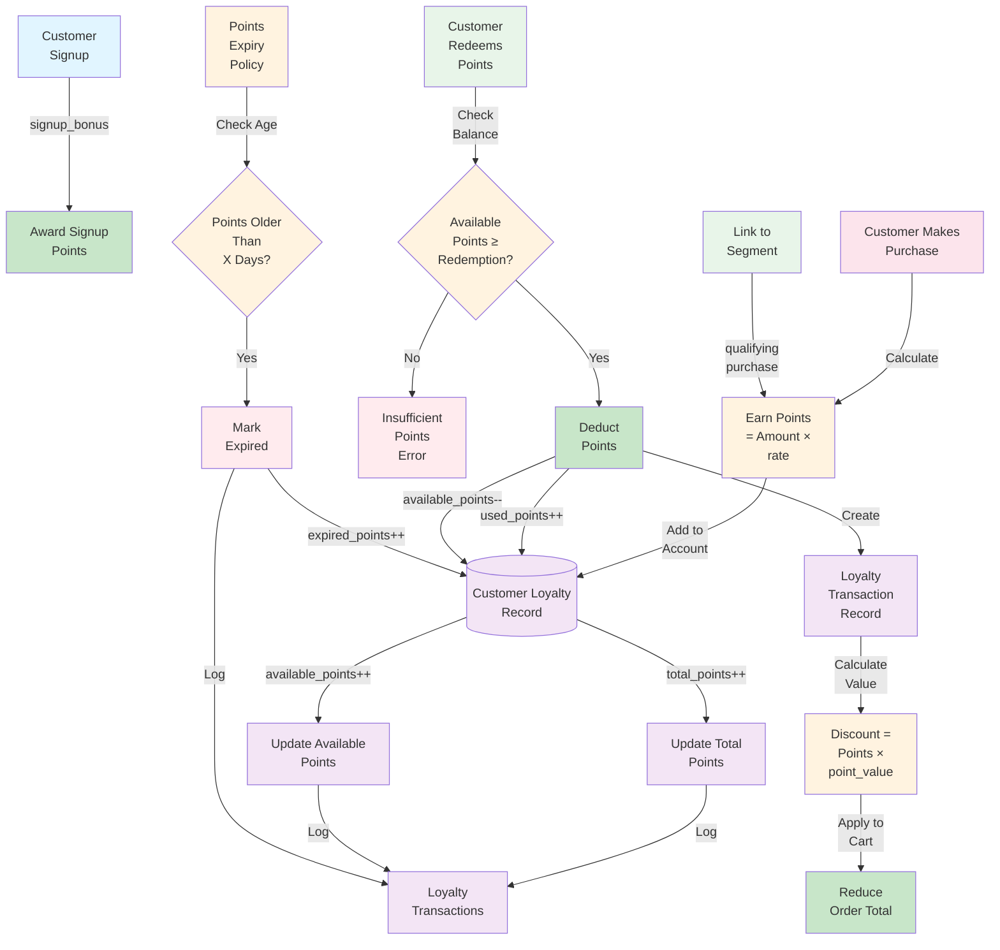
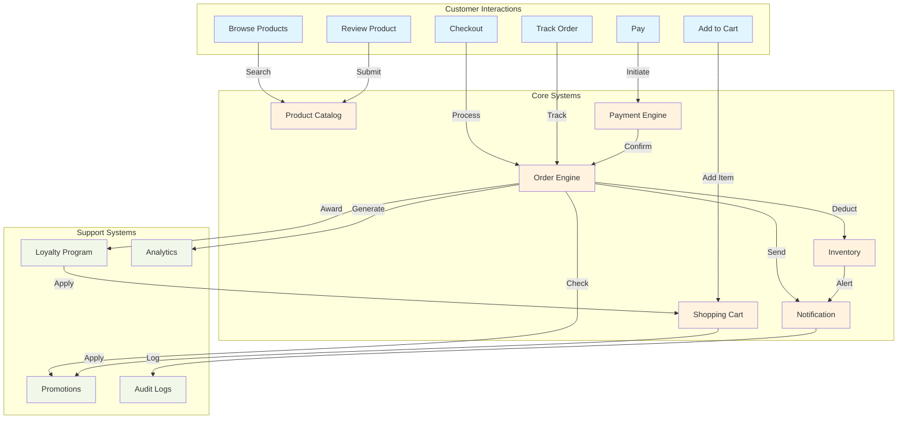

# DrKinjal - Data Flow Diagram (DFD) - Visual Guide

## Complete System DFD

---

## Detailed Process Flow: Customer Journey

---

## Data Flow: Order Processing

---

## Data Flow: Inventory Management

---

## Data Flow: Payment Processing

```mermaid
graph LR
    A["Order Ready<br/>for Payment"] -->|Order Total| B["Prepare<br/>Payment<br/>Request"]
    
    B -->|Amount<br/>Currency<br/>Customer ID| C["Submit to<br/>Razorpay"]
    
    C -->|Generate<br/>Payment Link| D["Customer<br/>Enters Details"]
    
    D -->|Payment<br/>Credentials| E["Razorpay<br/>Processes"]
    
    E -->|Bank/Card<br/>Network| F["Payment<br/>Processor"]
    
    F -->|Success| G["Razorpay<br/>Confirms"]
    F -->|Failed| H["Razorpay<br/>Denies"]
    
    G -->|Webhook<br/>Callback| I["System Receives<br/>Confirmation"]
    H -->|Webhook<br/>Callback| J["System Receives<br/>Failure"]
    
    I -->|Verify<br/>Signature| K{Valid<br/>Signature?}
    J -->|Log<br/>Failure| L["Update Order<br/>Payment Status:<br/>FAILED"]
    
    K -->|Yes| M["Update Order<br/>Payment Status:<br/>PAID"]
    K -->|No| N["Security Alert"]
    
    M -->|Trigger<br/>Success| O["Deduct Inventory"]
    M -->|Send| P["Send Confirmation<br/>Email"]
    M -->|Add| Q["Calculate Loyalty<br/>Points"]
    
    L -->|Offer<br/>Retry| R["Retry Payment<br/>Option"]
    
    O -->|Order| S["Mark Order<br/>Ready for<br/>Fulfillment"]
    
    style A fill:#e1f5ff
    style B fill:#f3e5f5
    style C fill:#fce4ec
    style D fill:#e1f5ff
    style E fill:#fff9c4
    style F fill:#fff3e0
    style G fill:#c8e6c9
    style H fill:#ffcdd2
    style I fill:#f3e5f5
    style J fill:#f3e5f5
    style K fill:#fff3e0
    style L fill:#ffebee
    style M fill:#c8e6c9
    style N fill:#ffebee
    style O fill:#f3e5f5
    style P fill:#e0f2f1
    style Q fill:#e8f5e9
    style R fill:#fff3e0
    style S fill:#f3e5f5
```

---

## Data Flow: Promotional Engine

---

## Data Flow: Notification System

---

## Data Flow: Loyalty Points System

---

## Data Flow Integration Map

---

## Context Diagram Summary

The DrKinjal e-commerce platform operates as a centralized system coordinating:

1. **Customer Interactions** (Input):
   - Browse products
   - Manage cart
   - Place orders
   - Make payments
   - Track shipments
   - Submit reviews

2. **External Systems** (Integration):
   - Razorpay (Payment Gateway)
   - SMTP Server (Email)
   - SMS Provider (Messaging)
   - Courier Services (Shipping)

3. **Data Processing** (Core):
   - Product catalog management
   - order processing
   - Payment processing
   - Inventory tracking
   - Customer communication

4. **Outputs** (Responses):
   - Order confirmations
   - Shipping updates
   - Customer notifications
   - Admin reports
   - Analytics data

