# DrKinjal - Entity Relationship Diagram (ER) - Complete Reference

## Master ER Diagram Overview

```mermaid
erDiagram
    CUSTOMERS ||--o{ CUSTOMER_ADDRESSES : has
    CUSTOMERS ||--o{ CUSTOMER_LOYALTY : joins
    CUSTOMERS ||--o{ CARTS : creates
    CUSTOMERS ||--o{ ORDERS : places
    CUSTOMERS ||--o{ PRODUCT_REVIEWS : writes
    CUSTOMERS ||--o{ WISHLIST_ITEMS : adds
    CUSTOMERS ||--o{ GIFT_CARDS : purchases
    
    PRODUCTS ||--o{ PRODUCT_VARIANTS : contains
    PRODUCTS ||--o{ PRODUCT_REVIEWS : receives
    PRODUCTS ||--o{ PRODUCT_SPECIFICATIONS : has
    PRODUCTS ||--o{ RELATED_PRODUCTS : relates_to
    PRODUCTS ||--o{ CROSS_SELL_PRODUCTS : cross_sells
    PRODUCTS ||--o{ UPSELL_PRODUCTS : upsells
    PRODUCTS ||--o{ CATEGORY_PRODUCT : belongs_to
    PRODUCTS ||--o{ OFFER_REWARDS : rewards
    PRODUCTS ||--o{ PRICE_HISTORIES : tracks
    
    PRODUCT_VARIANTS ||--o{ VARIANT_ATTRIBUTES : has
    PRODUCT_VARIANTS ||--o{ VARIANT_IMAGES : displays
    PRODUCT_VARIANTS ||--o{ CART_ITEMS : adds_to_cart
    PRODUCT_VARIANTS ||--o{ ORDER_ITEMS : includes_in_order
    PRODUCT_VARIANTS ||--o{ WISHLIST_ITEMS : adds_to_wishlist
    PRODUCT_VARIANTS ||--o{ STOCK_HISTORY : tracks_stock
    PRODUCT_VARIANTS ||--o{ WAREHOUSE_STOCKS : inventories
    PRODUCT_VARIANTS ||--o{ TIER_PRICES : prices
    PRODUCT_VARIANTS ||--o{ OFFER_VARIANTS : applies_offer
    
    CATEGORIES ||--o{ PRODUCTS : contains
    CATEGORIES ||--o{ CATEGORY_ATTRIBUTES : requires
    CATEGORIES ||--o{ CATEGORY_SPEC_GROUPS : has_specs
    CATEGORIES ||--o{ CATEGORY_PRODUCT : assigns
    CATEGORIES ||--o{ OFFER_CATEGORIES : applies
    
    ATTRIBUTES ||--o{ ATTRIBUTE_VALUES : contains
    ATTRIBUTES ||--o{ VARIANT_ATTRIBUTES : specifies
    ATTRIBUTES ||--o{ CATEGORY_ATTRIBUTES : required_by
    
    OFFERS ||--o{ OFFER_USAGES : tracks
    OFFERS ||--o{ OFFER_VARIANTS : includes_products
    OFFERS ||--o{ OFFER_CATEGORIES : includes_categories
    OFFERS ||--o{ OFFER_REWARDS : rewards
    
    CARTS ||--o{ CART_ITEMS : contains
    ORDERS ||--o{ ORDER_ITEMS : contains
    ORDERS ||--o{ ORDER_STATUS_HISTORY : tracks
    ORDERS ||--o{ SHIPMENTS : ships_via
    ORDERS ||--o{ PAYMENTS : receives
    ORDERS ||--o{ RETURNS : allows_return
    
    SHIPMENTS ||--o{ SHIPMENT_ITEMS : includes
    RETURNS ||--o{ RETURN_ITEMS : requests_return
    
    PAYMENTS ||--o{ PAYMENT_ATTEMPTS : attempts
    
    WAREHOUSES ||--o{ WAREHOUSE_STOCKS : stores
    WAREHOUSES ||--o{ INVENTORY_TRANSFERS : transfers_from
    INVENTORY_TRANSFERS ||--o{ INVENTORY_TRANSFER_ITEMS : transfers
    
    LOYALTY_PROGRAMS ||--o{ CUSTOMER_LOYALTY : enrolls
    CUSTOMER_LOYALTY ||--o{ LOYALTY_TRANSACTIONS : earns
    
    BRANDS ||--o{ PRODUCTS : manufactures
    TAGS ||--o{ PRODUCTS : tags
    
    PRODUCT_REVIEWS ||--o{ REVIEW_IMAGES : includes
    PRODUCT_REVIEWS ||--o{ REVIEW_VOTES : receives
```

---

## Detailed Entity Groups - Visual Representations

### Group 1: User & Authentication

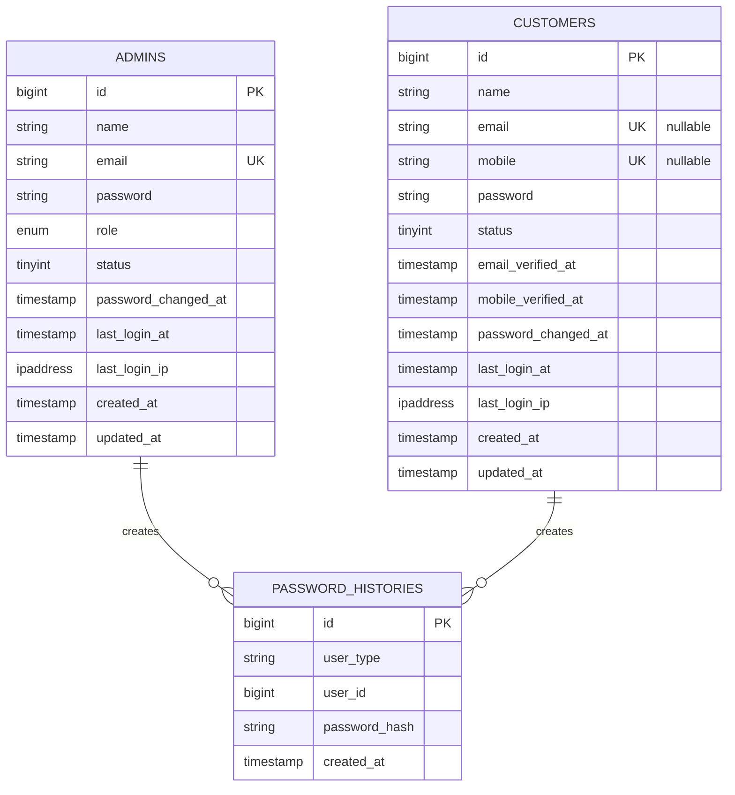

### Group 2: Product Catalog

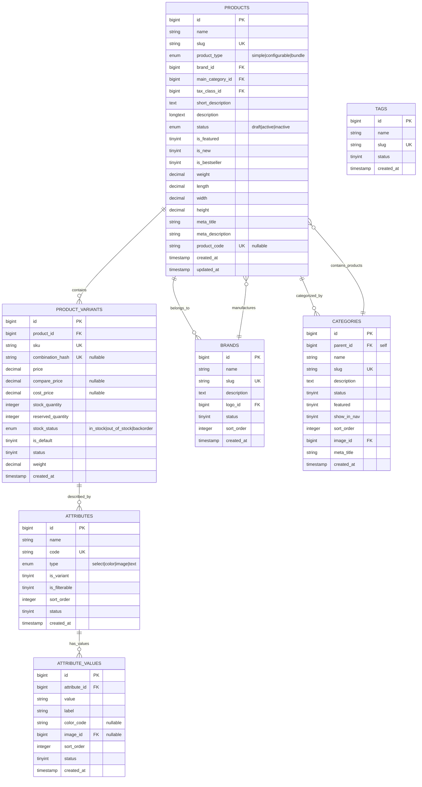

### Group 3: Shopping & Cart

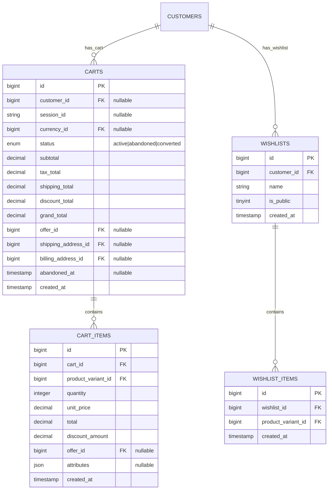

### Group 4: Orders & Payments

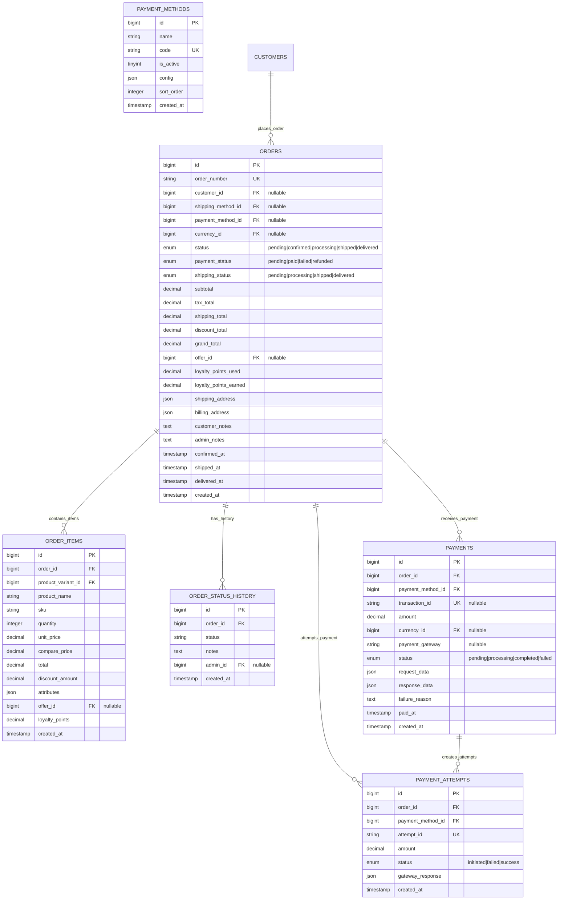

### Group 5: Inventory & Warehouses

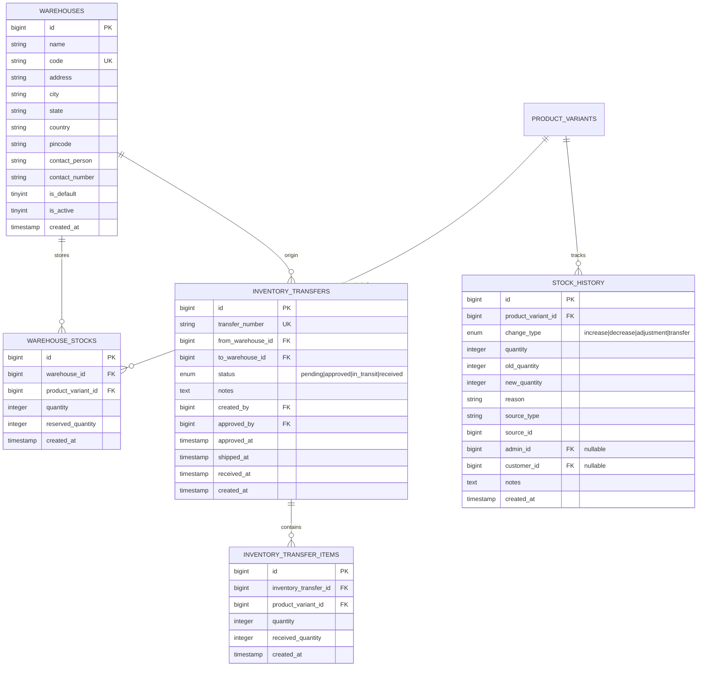

### Group 6: Shipments & Returns

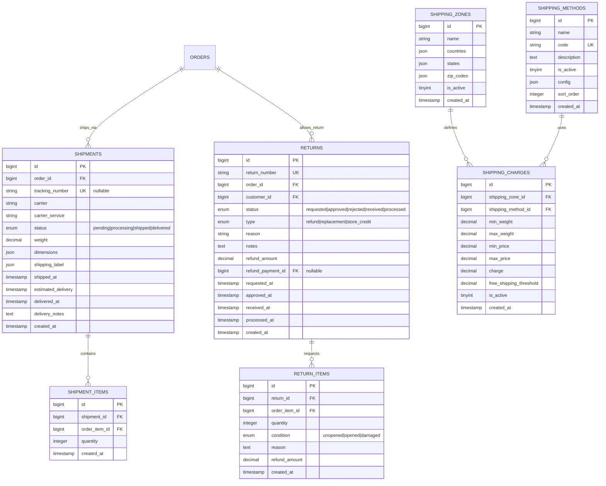

### Group 7: Promotions & Loyalty

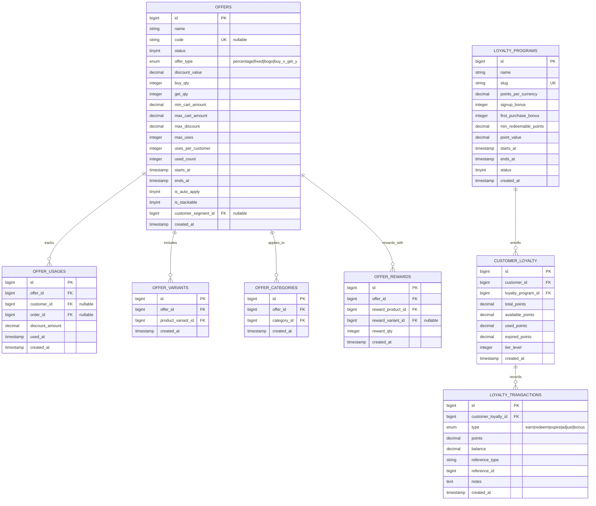

### Group 8: Reviews & Ratings

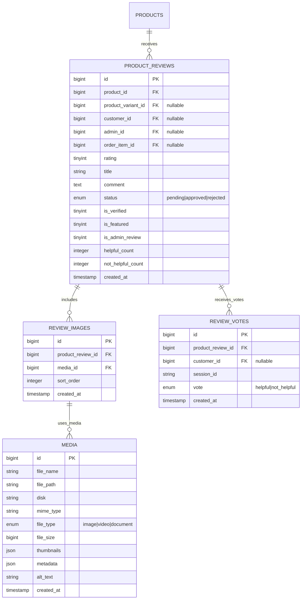

### Group 9: Customer Data

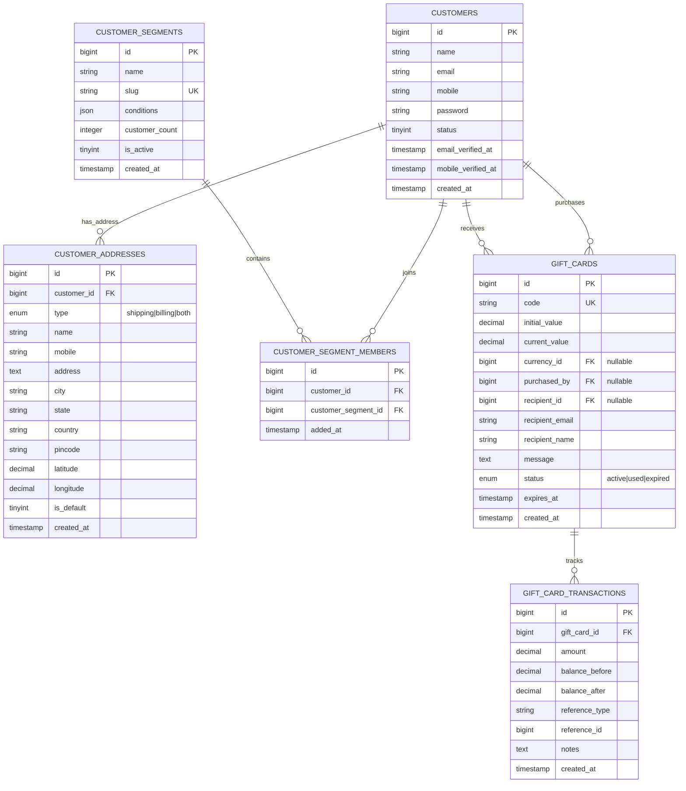

### Group 10: Pricing & Tax

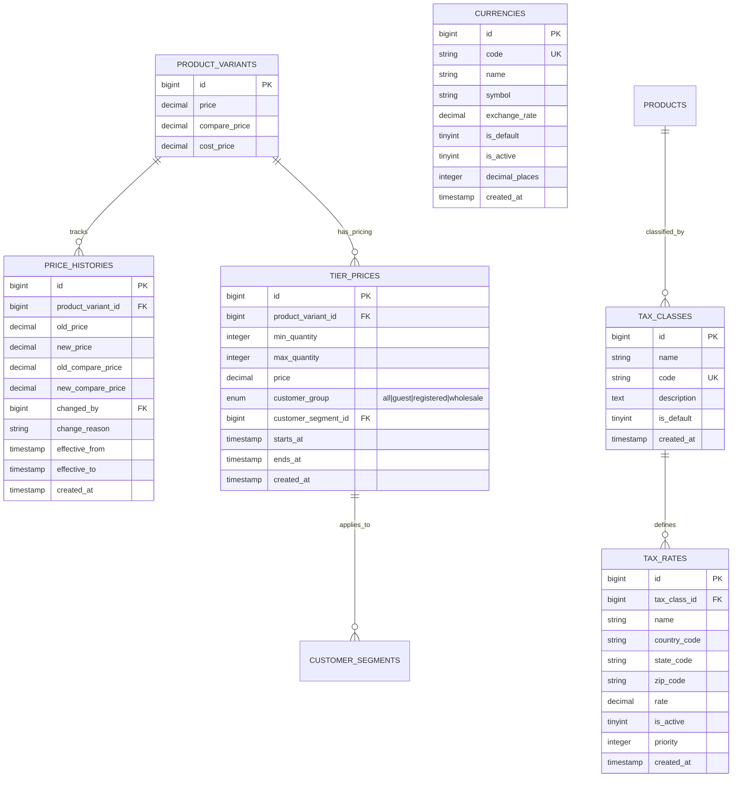

---

## Relationships Summary

### One-to-Many (1:N)
- **Products ↔ Product Variants**: One product has many SKU variants
- **Categories ↔ Products**: One category contains many products
- **Customers ↔ Orders**: One customer places many orders
- **Orders ↔ Order Items**: One order contains many items
- **Warehouses ↔ Warehouse Stocks**: One warehouse manages stock of many products
- **Offers ↔ Offer Usages**: One offer is used many times

### Many-to-Many (N:M)
- **Products ↔ Categories**: Through `category_product` pivot table
- **Products ↔ Tags**: Through `product_tags` pivot table
- **Attributes ↔ Categories**: Through `category_attributes` pivot table
- **Attributes ↔ Variants**: Through `variant_attributes` pivot table
- **Offers ↔ Products**: Through `offer_variants` pivot table
- **Offers ↔ Categories**: Through `offer_categories` pivot table

### Self-Referencing
- **Categories ↔ Categories**: Parent-child hierarchy via `parent_id`
- **Products ↔ Products**: Related, cross-sell, upsell products

### Polymorphic
- **Password Histories**: Stores passwords for both Admins and Customers
- **Notifications**: Notifies different entity types (customers, admins)
- **Activity Logs**: Tracks changes by different user types

---

## Data Integrity & Constraints

### Unique Constraints
```
- customers(email)
- customers(mobile)
- product_variants(sku)
- products(slug)
- categories(slug)
- offers(code)
- gift_cards(code)
- currencies(code)
- tax_classes(code)
- shipping_methods(code)
- brands(slug)
- tags(slug)
```

### Foreign Key Constraints
All foreign keys follow CASCADE or SET NULL policies:
- **CASCADE**: When parent deleted, delete child records
  - products → product_variants
  - categories → products
  - orders → order_items, order_status_history
  
- **SET NULL**: When parent deleted, set foreign key to NULL
  - products.brand_id
  - products.main_category_id
  - payment_attempts.payment_method_id
  - collection → collection_category

### Check Constraints (Implicit)
- `price` ≥ 0
- `quantity` ≥ 0
- `rating` BETWEEN 1 AND 5
- `status` IN (predefined enum values)

---

## Database Statistics

| Category | Count | Tables |
|----------|-------|--------|
| **Catalog** | 16 | products, variants, categories, attributes, specs |
| **Transaction** | 14 | orders, payments, shipments, returns |
| **Customer** | 5 | customers, addresses, segments, loyalty |
| **Inventory** | 7 | warehouses, warehouse_stocks, transfers, stock_history |
| **Promotion** | 7 | offers, tiers, loyalty_programs, gift_cards |
| **Content** | 10 | media, reviews, notifications, pages, settings |
| **Admin** | 5 | activity_logs, audit_trails, email_logs, sms_logs |
| **Support** | 10 | returns, shipments, stock_history, transfers |
| **System** | 5 | settings, currencies, tax_classes, payment_methods |
| **Total** | **79** | **~70+ tables** |

---

## Query Optimization Considerations

### Essential Indices
```sql
CREATE INDEX idx_products_slug ON products(slug);
CREATE INDEX idx_products_status ON products(status);
CREATE INDEX idx_product_variants_sku ON product_variants(sku);
CREATE INDEX idx_product_variants_product_id ON product_variants(product_id);
CREATE INDEX idx_orders_customer_id_created ON orders(customer_id, created_at);
CREATE INDEX idx_orders_status ON orders(status);
CREATE INDEX idx_orders_payment_status ON orders(payment_status);
CREATE INDEX idx_cart_items_cart_id ON cart_items(cart_id);
CREATE INDEX idx_customer_addresses_customer_id ON customer_addresses(customer_id);
CREATE INDEX idx_category_product_product_id ON category_product(product_id);
CREATE INDEX idx_warehouse_stocks_warehouse_id ON warehouse_stocks(warehouse_id);
CREATE INDEX idx_stock_history_variant_id ON stock_history(product_variant_id, created_at);
CREATE FULLTEXT INDEX ft_products_search ON products(name, short_description, description);
```

### Query Patterns
1. **Product browsing**: `products` + `product_variants` + `categories`
2. **Cart operations**: `carts` + `cart_items` + `product_variants`
3. **Order history**: `orders` + `order_items` + `customers`
4. **Inventory check**: `product_variants` + `warehouse_stocks`
5. **Payment tracking**: `orders` + `payments` + `payment_methods`

---

## Schema Evolution Strategy

### Versioning
```
✓ Current Version: 2.0
✓ Created: 2025-12-21
✓ Latest Revision: 2026-02-15
```

### Recent Enhancements
- Added `is_block` to customers (2026-01-12)
- Added `payment_method` to orders (2026-01-11)
- Added `sort_order` to products (2026-01-24)
- Enhanced product dimensions with defaults (2026-01-19)
- Added COD availability flag to products (2026-01-19)

### Future Considerations
- Sharding by `customer_id` or geography
- Time-based partitioning for `orders`, `order_items`
- Materialized views for analytics
- Event sourcing for order lifecycle
- CQRS pattern separation

